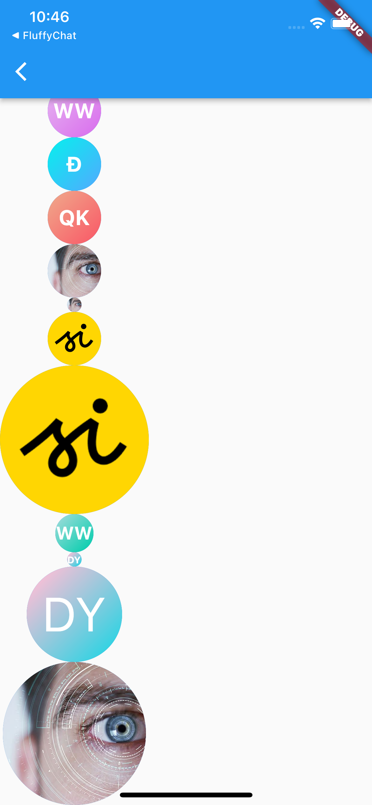
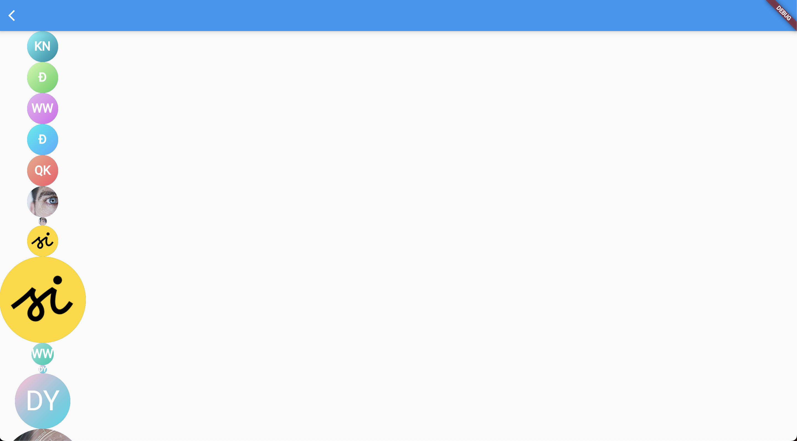

# linagora-design-flutter
An enterprise-class UI design language and Flutter UI library

| Components | Demo |
| ---------------| ---------------|
| CircleAvatar ios  | )  |
| CircleAvatar ios  |   |
| CircleAvatar web  |   |

## Credits

- **TwakeInter font** (bundled in `assets/fonts/`): a derivative of the [Inter](https://github.com/rsms/inter) typeface by Rasmus Andersson, modified to remove emoji glyphs that interfered with color emoji rendering on Flutter web. "Inter" is a Reserved Font Name under the SIL Open Font License. This derivative has been renamed to "TwakeInter" in compliance with that requirement. The font is licensed under **SIL OFL v1.1** (see `assets/fonts/LICENSE.txt`), independent of this package's license. To regenerate the font files, run `bash scripts/generate-twake-inter-fonts.sh` (requires `python3` with `fonttools`, `curl`, and `unzip`).
